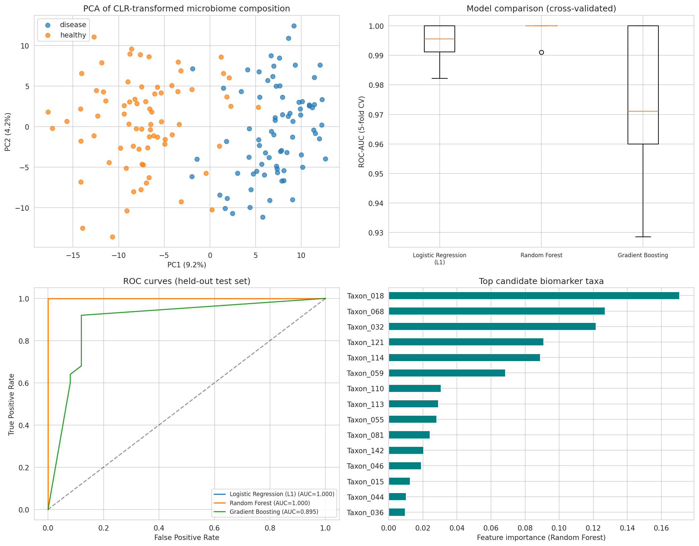

# microbeML

- entire ML pipeline for microbial machine learning. 
- complete steps for microbiome machine learning. 




```
counts = pd.read_csv("feature_table.csv", index_col=0)  # samples x taxa
y = pd.read_csv("metadata.csv", index_col=0)["disease_status"]

```

Gaurav Sablok \
gsablok@proton.me
